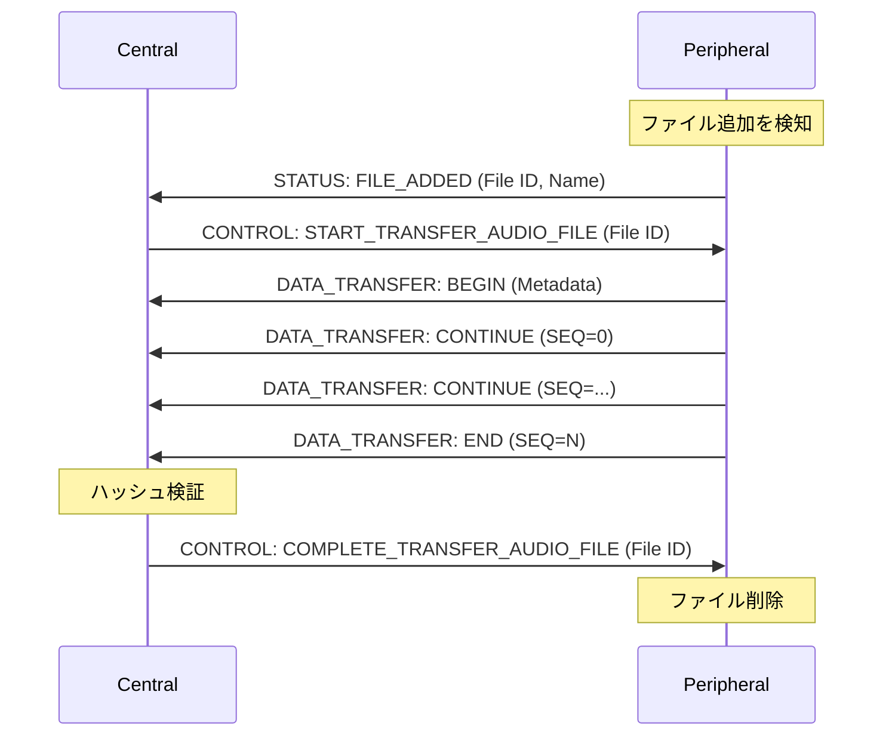

# TMSBLEServer 音声転送システム仕様書

## 1. 概要

BLE（Bluetooth Low Energy）を使用してPeripheralデバイスからCentralデバイスへ音声ファイルを転送するシステムです。

### 1.1 基本情報
- **作業ディレクトリ**: `TMSBLEServer`
- **作業ログファイル**: `AGENT_LOG.md`（タイムスタンプ付き）
- **動作環境**: macOS
- **実装言語**: Node.js
- **BLEロール**: Peripheral

### 1.2 監視対象
- **デフォルト監視ディレクトリ**: `../TMSAudioRecorder/recorded_audio/`
- **対象ファイル形式**: MP3
- **監視内容**: ファイルの追加・削除をリアルタイム検知

---

## 2. BLEサービス構成

### 2.1 Service UUID
```
Service UUID: 572542C4-2198-4D1E-9820-1FEAEA1BB9D0
```

### 2.2 Characteristics

| Characteristic | UUID | Properties | 説明 |
|---------------|------|------------|------|
| CONTROL | 572542C4-2198-4D1E-9820-1FEAEA1BB9D1 | Write | 操作命令の送受信 |
| STATUS | 572542C4-2198-4D1E-9820-1FEAEA1BB9D2 | Notify | ステータス通知 |
| DATA_TRANSFER | 572542C4-2198-4D1E-9820-1FEAEA1BB9D3 | Notify | データ転送 |

---

## 3. 通信プロトコル詳細

### 3.1 CONTROL Characteristic

**データフォーマット**
| フィールド | サイズ | 説明 |
|-----------|--------|------|
| Command | 1 byte | 操作命令コード |
| ID | 4 bytes (BE) | ID（インクリメンタル） |
| SEQ | 2 bytes (BE) | シーケンス番号 |
| Payload Length | 2 bytes (BE) | ペイロードのバイト数 |
| Payload | 可変 | コマンド固有のデータ |

**コマンド一覧**
| コマンド | 値 | ペイロード | 説明 |
|---------|-----|-----------|------|
| START_TRANSFER_AUDIO_FILE | 0x01 | File ID (4 bytes) | 指定ファイルの転送開始 |
| START_TRANSFER_AUDIO_FILE_AUTO | 0x02 | なし | 自動転送モード開始 |
| STOP_TRANSFER_AUDIO_FILE_AUTO | 0x03 | なし | 自動転送モード停止 |
| COMPLETE_TRANSFER_AUDIO_FILE | 0x04 | File ID (4 bytes) | 転送完了通知（ファイル削除） |

---

### 3.2 STATUS Characteristic

**データフォーマット**
| フィールド | サイズ | 説明 |
|-----------|--------|------|
| Type | 1 byte | ステータスタイプ |
| ID | 4 bytes (BE) | ID（インクリメンタル） |
| SEQ | 2 bytes (BE) | シーケンス番号 |
| Payload Length | 2 bytes (BE) | ペイロードのバイト数 |
| Payload | 可変 | ステータス固有のデータ |

**ステータスタイプ一覧**
| コマンド | 値 | ペイロード | 説明 |
|---------|-----|-----------|------|
| FILE_ADDED | 0x10 | File ID (4 bytes) | ファイル追加通知 |
| FILE_DELETED | 0x11 | File ID (4 bytes) | ファイル削除通知 |

---

### 3.3 DATA_TRANSFER Characteristic

**データフォーマット**
| フィールド | サイズ | 説明 |
|-----------|--------|------|
| Flag | 1 byte | 転送フラグ |
| ID | 4 bytes (BE) | シーケンス番号（デクリメント方式） |
| Payload Length | 2 bytes (BE) | ペイロードのバイト数 |
| Payload | 可変 | データ内容 |

**転送フラグ一覧**
| コマンド | 値 | ペイロード | 説明 |
|---------|-----|-----------|------|
| BEGIN_TRANSFER_AUDIO_FILE | メタデータ | 0x20 | 転送開始 |
| CONTINUE_TRANSFER_AUDIO_FILE | 音声データ（バイナリ） | 0x21 | 転送継続 |
| END_TRANSFER_AUDIO_FILE | 0x22 | 音声データ（バイナリ） |  転送終了 |

**BEGIN_TRANSFER_AUDIO_FILE のペイロード（メタデータ）の構造**
| フィールド | サイズ | 説明 |
|-----------|--------|------|
| File ID | 4 bytes (BE) | ファイル ID (unixtime) |
| File Size | 4 bytes (BE) | ファイルサイズ（バイト） |
| File Hash | 256 bytes | ファイルハッシュ（SHA256） |
| Total Chunks | 2 bytes (BE) | 総チャンク数 |
---

## 4. データ転送フロー

### 4.1 ファイル転送シーケンス



### 4.2 自動転送モード

1. Centralが`START_TRANSFER_AUDIO_FILE_AUTO`コマンドを送信
2. Peripheralは新規ファイル検知時に自動的に転送開始
3. 転送完了後、Centralが`COMPLETE_TRANSFER_AUDIO_FILE (File ID)`コマンドを送信
4. Peripheralは File ID のファイルを削除
5. `STOP_TRANSFER_AUDIO_FILE_AUTO`で自動モード終了

---

## 5. 実装上の考慮事項

### 5.1 BLE制約
- **MTUサイズ**: デフォルト23バイト（ヘッダー3バイト除く実データ20バイト）
- **MTU交渉**: 接続後にMTU拡張を試みる（最大512バイト）
- **チャンク分割**: ペイロードがMTUを超える場合は自動分割

### 5.2 ファイル識別とトラッキング
- **File ID管理**: Peripheral側でFile IDとファイルパスのマッピングテーブルを保持
- **重複転送防止**: 転送中のFile IDをトラッキングし、重複要求を拒否
- **整合性検証**: メタデータのハッシュ値で転送完了後の整合性を確認
